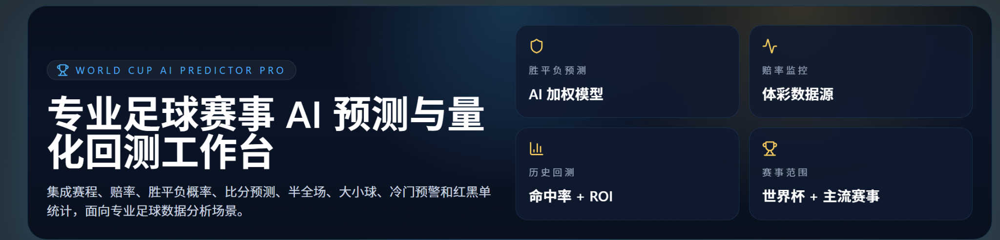
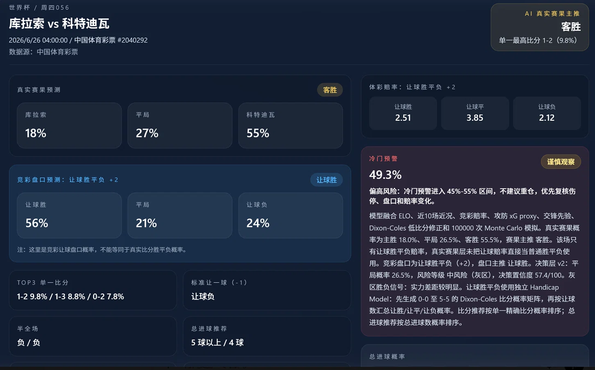
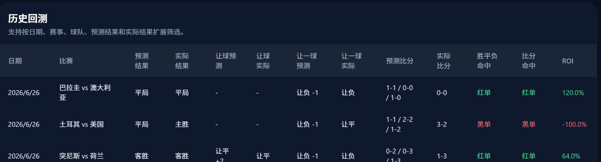

# World Cup AI Predictor Pro
面向体育赛事分析场景的智能决策 Agent 原型系统。

---

## 系统预览

### 首页



### AI预测页



### 历史回测


## 系统架构
## Agent Framework

本项目不仅是一个足球赛事预测系统，同时也是一个面向复杂决策任务的 Agent 原型系统。

### Multi-Reasoning Architecture

系统通过多个独立推理模块协同完成预测任务：

* ELO Rating Agent
* Form Analysis Agent
* Odds Intelligence Agent
* Poisson Simulation Agent
* Monte Carlo Scenario Agent
* Head-to-Head Analysis Agent

每个模块负责不同维度的信息分析，并向决策层输出结构化结果。

### Decision Layer

Decision Layer v3 负责：

* 聚合多模型推理结果
* 动态调整模型权重
* 识别高风险赛事
* 输出最终预测结论

实现从数据分析到决策输出的完整工作流。

### Future Agent Evolution

未来计划探索：

* Tool Calling
* Long-Term Memory
* Multi-Agent Collaboration
* Autonomous Workflow
* Context Engineering

进一步将系统演进为面向体育赛事分析场景的智能决策 Agent。

```text
中国体育彩票数据源
        ↓
    数据同步层
        ↓
    特征工程层
        ↓
 ┌───────────────┐
 │   ELO Engine  │
 ├───────────────┤
 │  Odds Engine  │
 ├───────────────┤
 │ Poisson Model │
 ├───────────────┤
 │ Monte Carlo   │
 ├───────────────┤
 │ H2H Analysis  │
 └───────────────┘
        ↓
 Decision Layer v3
        ↓
 Prediction Output
        ↓
 Backtest & ROI
```

---
专业足球赛事 AI 预测平台，覆盖世界杯、欧洲杯、欧冠、五大联赛以及中国体育彩票竞彩赛事。

## 数据原则

- 不生成 Mock Data。
- 不使用 `mock.ts`、`fakeData.ts`、`demoData.ts`、`randomData.ts`。
- 不写死主胜概率、冷门概率、比分、红黑单、命中率或 ROI。
- 所有预测来自数据库中的球队、赛程、赔率和赛果。
- 所有红黑单、ROI、收益曲线和命中率都从真实数据库实时计算。

## 已接入数据源

中国体育彩票竞彩：

```text
https://webapi.sporttery.cn/gateway/uniform/football/getMatchCalculatorV1.qry?channel=c&poolCode=had
```

当前同步字段包括：

- 赛事编号
- 开赛时间
- 联赛
- 主队
- 客队
- 胜平负赔率
- 数据源标识

后续可继续扩展同源接口中的让球、比分、半全场、总进球和赔率历史。

## AI 预测引擎

最终概率融合：

```text
30% ELO
20% FORM
20% ODDS
20% POISSON
10% MONTE CARLO
```

模型层：

- ELO Rating：从数据库球队评分计算。
- 近期状态：从数据库球队状态字段和赛果扩展。
- 赔率模型：竞彩赔率 `1 / odds` 后归一化。
- Poisson 比分模型：生成比分概率矩阵。
- Monte Carlo：每场 100000 次模拟，使用可复现种子，不生成假赛果。

输出：

- 主胜 / 平局 / 客胜概率
- AI 主推
- 最可能比分及概率
- Top3 比分
- 半全场倾向
- 总进球概率
- 大小球
- 双方进球
- 0-100 信心指数
- 动态冷门概率

## 后端 API

- `GET /api/matches`
- `GET /api/odds`
- `POST /api/predict`
- `GET /api/results`
- `POST /api/results/settle`
- `GET /api/statistics`
- `GET /api/roi`
- `GET /api/history`
- `POST /api/data-sources/sporttery/sync`

## 本地启动

### 后端

```bash
cd backend
python -m venv .venv
.venv\Scripts\activate
pip install -r requirements.txt
uvicorn app.main:app --reload --port 8000
```

### 前端

```bash
cd frontend
npm install
npm run dev
```

访问：

```text
http://127.0.0.1:3000
```

## Docker

```bash
docker compose up --build
```

服务：

- Frontend: `3000`
- Backend: `8000`
- PostgreSQL: `5432`
- Redis: `6379`

## 定时任务

APScheduler 会在后端启动时注册：

- 每 15 分钟同步中国体育彩票竞彩数据。
- 每天 00:10 执行已完赛预测结算。

Redis 用于缓存扩展；本地 Redis 未启动时，后端会自动降级，不影响 API 启动。

